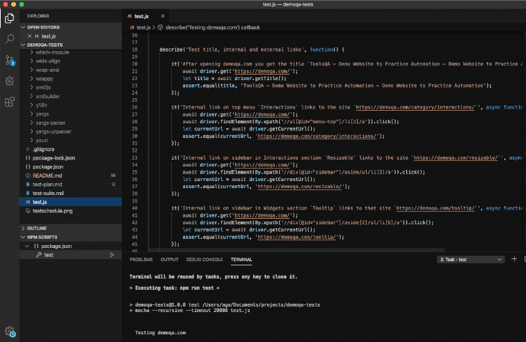

# [DEMOQA.COM](https://demoqa.com) TESTS

[demoqa.com](https://demoqa.com) is a basic demo site provided by [toolsqa.com](https://www.toolsqa.com) to learn and practice Selenium. It contains training modules like contact forms, menus to select, buttons to click etc.

More details about the object, approach, features to be tested and schedule of all testing activities are to find in [Test Plan](https://github.com/agafun/demoqa-tests/blob/master/test-plan.md).

## Methods
In these automated tests I have used a combination of Selenium WebDriver with Java Script. I have learned many methods like:
```
get()
getTitle()
getCurrentUrl()
getAttribute()
getText()
findElement()
click()
sendKeys()
switchTo()
```
or methods from Actions class:
```
keyDown()
keyUp()
dragAndDrop()
doubleClick()
contextClick()
move()
```

## Tests

There are 38 test cases presented in this [Test Suite](https://github.com/agafun/demoqa-tests/blob/master/test-suite.md). 32 are passed and 6 are failed through assertion errors (5) or NoSuchAlertError (1).  

Below video record presents the test script execution:



Test results are presented below:

```
Testing demoqa.com
    Test title, internal and external links
      ✓ After opening demoqa.com you get the title `ToolsQA – Demo Website to Practice Automation – Demo Website to Practice Automation` (2917ms)
      ✓ Internal link on top menu `Interactions` links to the site `https://demoqa.com/category/interactions/` (823ms)
      ✓ Internal link on sidebar in Interactions section `Resizable` links to the site `https://demoqa.com/resizable/` (1186ms)
      ✓ Internal link on sidebar in Widgets section `Tooltip` links to thet site `https://demoqa.com/tooltip/` (888ms)
      ✓ The external link on the header links to toolsqa.com (3381ms)
    Test the Selectable
      ✓ After selecting Item 1, Item 1 is highlighted in orange (892ms)
      ✓ After selecting Item 7, Item 7 is highlighted in orange (544ms)
      ✓ After selecting Item 1, 2 and 3 with ctrl/cmd button, Item 1, 2 and 3 are highlighted in orange (584ms)
      ✓ After selecting Item 1, 2 and 3 and deselecting Item 2 with ctrl/cmd button, only Item 1 and 3 are highlighted in orange (637ms)
      ✓ After selecting Item 1, 2 and 3 with ctrl/cmd button and selecting Item 1 once again, only Item 1 is highlighted in orange (617ms)
      ✓ After selecting Item 4 to 7 by dragging a mouse, Item 4, 5, 6 and 7 are highlighted in orange (743ms)
      ✓ After selecting Item 4 to 7 by dragging a mouse and selecting Item 7 once again, only Item 7 is highlighted in orange (759ms)
    Test the Resizable
      1) The element is resized horizontally by 100 px
      2) The element is resized horizontally by 200 px
      3) The element is resized diagonally to the minimum size
    Test the Droppable
      ✓ After dragging the element to the target the element is within the target square and the target square is colored yellow with inscription `Dropped!` (703ms)
      ✓ After dragging the element not to the target the element is placed on release point and the target square is colored gray with inscription `Drop here` (683ms)
      ✓ After dragging the element not whole to the target the element is placed on release point and the target square is colored gray with inscription `Drop here` (834ms)
    Test the HTML contact form
      ✓ After clicking Submit button you should be redirected to a search website and the url address should contain value of Country and Subject as parameters (1513ms)
      ✓ After clicking Submit button you should be redirected to a search website and the url address should contain value of Country and Subject as parameters despite special characters (1399ms)
    Test the Keyboard Events
      ✓ After choosing a file and clicking `Click to Upload` button you should see a window with file path: "C:\fakepath\file-upload.png" (591ms)
    Test the Tooltip and Double click
      ✓ After double click on double click button you should see an alert window (598ms)
      4) After right-click on right-click button you should see a select menu
      ✓ After hover over hover element you should see a tooltip (1458ms)
    Test the Slider
      ✓ Slider moves by dragging a mouse to the release point (689ms)
      ✓ Slider moves by clicking a bar to the click point (1469ms)
    Test the Dialog
      ✓ Dialog window moves to the release point (957ms)
      5) Size of dialog window is changed horizontally and vertically in all four directions
      6) Size of dialog window is changed diagonally in all four directions
      ✓ After closing the dialog window with `x` icon, the window is not visible any more (535ms)
    Test the Datepicker
      ✓ After clicking on input field, you should see a calendar with highlighted today’s date (524ms)
      ✓ After choosing the today’s date in calendar, you should see a today’s date in input field in format mm/dd/yyyy (613ms)
      ✓ After writing a date in format 12/21/2019 you should see a calendar with highlighted date 21/12/2019 (536ms)
      ✓ After writing a date in format 01/14/0030 you should see a calendar with highlighted date 21/12/2030 (461ms)
      ✓ After writing a date in format 01/14/0031 you should see a calendar with highlighted date 21/12/1931 (468ms)
    Test the Checkboxradio
      ✓ After selecting New York, Paris and London in Radio Group only London is selected (789ms)
      ✓ After checking 2 Star, 3 Star, 4 Star and 5 Star and unchecking 4 Star in Checkbox only 2 Star, 3 Star and 5 Star are checked (757ms)
      ✓ After checking 2 Double, 2 Queen, 1 Queen, 1 King and unchecking 2 Double in Checkbox only 2 Queen, 1 Queen and 1 King are checked (777ms)


  32 passing (41s)
  6 failing

  1) Testing demoqa.com
       Test the Resizable
         The element is resized horizontally by 100 px:

      AssertionError [ERR_ASSERTION]: 233 == 250
      + expected - actual

      -233
      +250
      
      at Context.<anonymous> (test.js:169:20)
      at processTicksAndRejections (internal/process/task_queues.js:93:5)

  2) Testing demoqa.com
       Test the Resizable
         The element is resized horizontally by 200 px:

      AssertionError [ERR_ASSERTION]: 333 == 350
      + expected - actual

      -333
      +350
      
      at Context.<anonymous> (test.js:181:20)
      at processTicksAndRejections (internal/process/task_queues.js:93:5)

  3) Testing demoqa.com
       Test the Resizable
         The element is resized diagonally to the minimum size:

      AssertionError [ERR_ASSERTION]: 17 == 10
      + expected - actual

      -17
      +10
      
      at Context.<anonymous> (test.js:191:20)
      at processTicksAndRejections (internal/process/task_queues.js:93:5)

  4) Testing demoqa.com
       Test the Tooltip and Double click
         After right-click on right-click button you should see a select menu:
     NoSuchAlertError: no such alert
  (Session info: chrome=80.0.3987.106)
      at Object.throwDecodedError (node_modules/selenium-webdriver/lib/error.js:550:15)
      at parseHttpResponse (node_modules/selenium-webdriver/lib/http.js:563:13)
      at Executor.execute (node_modules/selenium-webdriver/lib/http.js:489:26)
      at processTicksAndRejections (internal/process/task_queues.js:93:5)
      at async Driver.execute (node_modules/selenium-webdriver/lib/webdriver.js:699:17)
      at async Context.<anonymous> (test.js:281:29)

  5) Testing demoqa.com
       Test the Dialog
         Size of dialog window is changed horizontally and vertically in all four directions:

      AssertionError [ERR_ASSERTION]: Expected values to be loosely deep-equal:

{
  height: 319,
  width: 484,
  x: 350,
  y: 172.5
}

should loosely deep-equal

{
  height: 319,
  width: 484,
  x: 350,
  y: 194.5
}
      + expected - actual

       {
         "height": 319
         "width": 484
         "x": 350
      -  "y": 172.5
      +  "y": 194.5
       }
      
      at Context.<anonymous> (test.js:342:20)
      at processTicksAndRejections (internal/process/task_queues.js:93:5)

  6) Testing demoqa.com
       Test the Dialog
         Size of dialog window is changed diagonally in all four directions:

      AssertionError [ERR_ASSERTION]: Expected values to be loosely deep-equal:

{
  height: 150,
  width: 668,
  x: 250,
  y: 272.5
}

should loosely deep-equal

{
  height: 150,
  width: 668,
  x: 250,
  y: 294.5
}
      + expected - actual

       {
         "height": 150
         "width": 668
         "x": 250
      -  "y": 272.5
      +  "y": 294.5
       }
      
      at Context.<anonymous> (test.js:363:20)
      at processTicksAndRejections (internal/process/task_queues.js:93:5)


npm ERR! code ELIFECYCLE
npm ERR! errno 6
npm ERR! demoqa-tests@1.0.0 test: `mocha --recursive --timeout 20000 test.js`
npm ERR! Exit status 6
npm ERR! 
npm ERR! Failed at the demoqa-tests@1.0.0 test script.
npm ERR! This is probably not a problem with npm. There is likely additional logging output above.

npm ERR! A complete log of this run can be found in:
npm ERR!     /Users/aga/.npm/_logs/2020-02-14T12_03_53_864Z-debug.log
The terminal process terminated with exit code: 6
```


