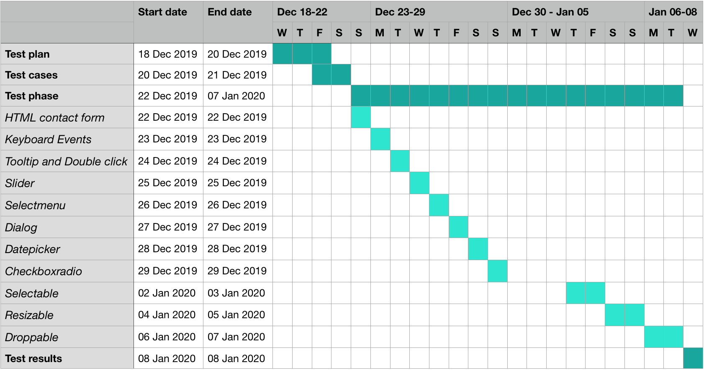

# TEST PLAN FOR [DEMOQA.COM](https://demoqa.com)

## 1. Introduction

The test plan describes the object, approach and schedule of all testing activities of the website [demoqa.com](https://demoqa.com). It identifies the test object, the features to be tested, the type of testing, and the tools to be used, required to complete testing.

## 2. Test object

[demoqa.com](https://demoqa.com) is a basic demo site provided by [toolsqa.com](https://www.toolsqa.com) to learn and practice Selenium. It contains training modules like contact forms, menus to select, buttons to click etc. divided into Interactions section and Widgets section. Only chosen features are going to be tested.

## 3. Features to be tested

| Module | Description |
| ----- | --------- |
| `Interactions section:` |
| Selectable | A list of items which can be selected |
| Resizable | An element which can be resized with dragging the mouse: height, width or both at once |
| Droppable | An element which can be dragged to a target element |
| `Widgets section:` |
| HTML contact form | A contact form with textfields, links and submit button |
| Keyboard Events | A file upload demo |
| Tooltip and Double click | A double click button, a right-click button and a hover |
| Slider | A slider bar |
| Dialog | A dialog window which can be moved, resized and closed |
| Datepicker | A text field with calendar |
| Checkboxradio | A radio checkbox and multi choice checkboxes |

## 4. Features not to be tested

- Interactions section:
    - Sortable
    - Draggable
- Widgets section:
    - Automation Practice Switch Windows
    - Keyboard Events Sample Form
    - Tooltip
    - Tabs
    - Spinner
    - Selectmenu
    - Progressbar
    - Menu
    - Controlgroup
    - Button
    - Autocomplete
    - Accordion

## 5. Test type

The test type is a functional module testing - all modules are tested separately.

## 6. Test objective

The test objective is to test the functionalities and to learn an end-to-end testing process with Selenium Webdriver.

## 7. Testing criteria

### 7.1 Test entry criteria

The test plan and test cases are prepared and the environment is set up.

### 7.2 Test exit criteria

Run rate is mandatory to be 100%. Mandatory pass rate is not defined, because the test object is a basic demo website.

## 8. Test environment

The tests are going to be performed on the Google Chrome web browser, version 79.0.3945.88 (official version) (64-bit) - access on 18 Dec 2019.

The tests are going to be run in Visual Studio Code version 1.40.1.

Operation system is MacOS Catalina version 10.15.2.

## 9. Schedule

## 10. Test deliverables

| Title | Author | Description |
| ------ | ------- | --- |
| Test plan | Agnieszka Burczyk | Object, approach and schedule of all testing activities of the website [demoqa.com](https://demoqa.com) |
| Test suite | Agnieszka Burczyk | A list of test cases with expexted results, reproduction steps and potential problems |
| Test tool | Agnieszka Burczyk | A script which runs all test cases |
